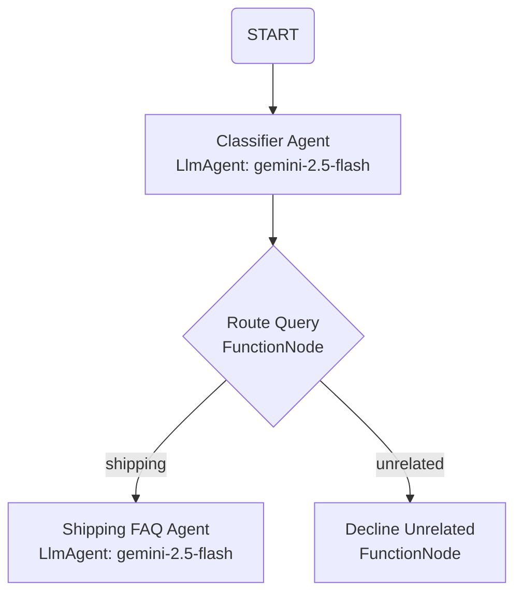

# Customer Support Triage & FAQ Agent

A graph-based customer support agent built with the **Agent Development Kit (ADK) 2.0** and powered by **Gemini 2.5 Flash**.

This agent acts as a virtual customer support representative for a shipping company. It automatically triages incoming user queries to determine whether they are related to shipping operations (such as rates, tracking, delivery status, and returns). If related, the query is routed to a specialized FAQ agent; if unrelated, it is routed to a deterministic node that politely declines to answer.

---

## 🛠️ Graph Architecture

The agent's logic is structured as a Directed Acyclic Graph (DAG) built using the ADK 2.0 `Workflow` API:



### Node breakdown
1. **`START`**: The entry point. Receives the user prompt and forwards it to the classifier.
2. **`classifier_agent` (LlmAgent)**: Prompts Gemini 2.5 Flash to classify whether the query is shipping-related. It outputs a structured Pydantic `Classification` schema.
3. **`route_query` (FunctionNode)**: A deterministic Python function that inspects the classification result and issues a routing `Event` with the target route name (`"shipping"` or `"unrelated"`).
4. **`shipping_faq_agent` (LlmAgent)**: An LLM-based agent tailored to answer shipping questions about rates, delivery, tracking, and returns. It references the conversation history to read the original question.
5. **`decline_unrelated` (FunctionNode)**: A deterministic Python function that immediately returns a polite, pre-formatted decline message for any off-topic queries.

---

## 📁 Project Structure

*   **`app/`**: Contains the source code of the agent application.
    *   `agent.py`: Holds the definitions of the workflow, nodes, schemas, and routes.
    *   `fast_api_app.py`: Sets up the local FastAPI server to expose the agent.
*   **`tests/`**: Contains the testing suite.
    *   `integration/test_agent.py`: Runs automated integration tests simulating shipping and non-shipping queries.
    *   `integration/test_server_e2e.py`: Ensures the local web server behaves properly.
*   **`tests/eval/`**: Configurations and datasets for the evaluation pipeline.

---

## 🚀 Getting Started

### Prerequisites

Ensure you have the following installed on your machine:
*   **uv**: Fast Python package manager ([Installation Guide](https://docs.astral.sh/uv/getting-started/installation/))
*   **agents-cli**: Google Agents CLI. Install via:
    ```bash
    uv tool install google-agents-cli
    ```

### Local Setup

1.  **Configure Environment Variables**:
    Create a `.env` file in the project root containing your Gemini API key (this has been configured for you):
    ```env
    GEMINI_API_KEY=your-api-key-here
    GOOGLE_GENAI_USE_VERTEXAI=False
    GOOGLE_GENAI_USE_ENTERPRISE=False
    ```

2.  **Install Dependencies**:
    Sync the virtual environment and install all packages:
    ```bash
    agents-cli install
    ```

---

## 💻 Development & Testing

### Running the Web Playground
To run the agent locally in an interactive chat interface:
```bash
uv run adk web --host 127.0.0.1 --port 8085 --reload_agents
```
Open **[http://127.0.0.1:8085/dev-ui/?app=app](http://127.0.0.1:8085/dev-ui/?app=app)** in your browser to start chatting with the agent.

### Running Automated Tests
Run the test suite using `pytest`:
```bash
uv run pytest
```

### Checking Code Quality & Linting
Run the automated style and type checks:
```bash
agents-cli lint
```
